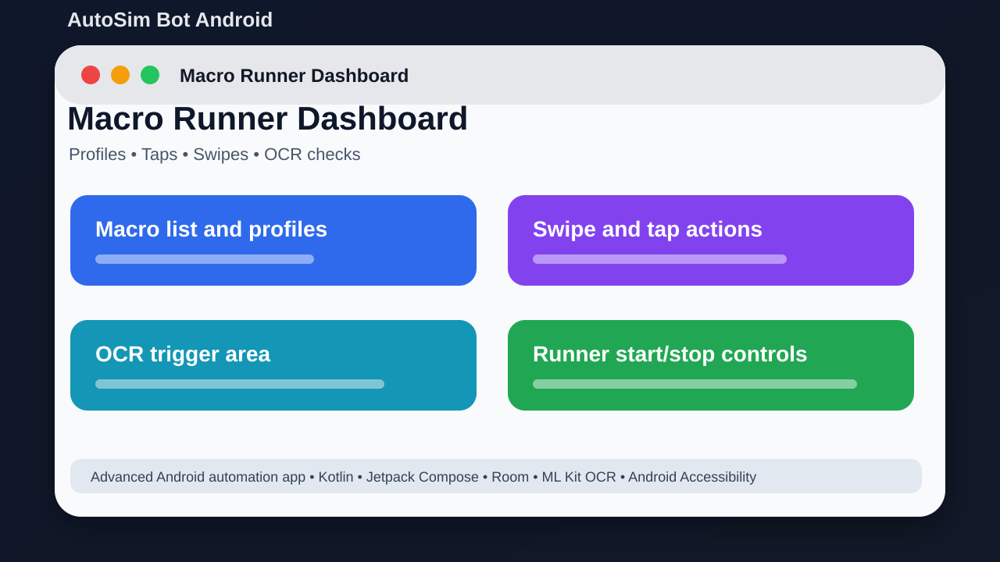

# AutoSim Bot Android



## Short Description

A bigger Android automation bot with macros, OCR areas, swipes, and profiles.

## About This Project

AutoSim Bot Android is an advanced Android automation project. It is like a stronger auto-clicker, but with saved macros, swipe actions, OCR checks, profile data, and runner controls.

The goal is to keep the project easy to understand, easy to run, and useful for learning or further development.

## Main Features

- Save taps, swipes, and macros
- Build repeatable phone workflows
- Use OCR areas for text-based triggers
- Control automation from overlay tools
- Store profiles and settings locally
- Import/export automation settings

## Tech Stack

- Kotlin
- Jetpack Compose
- Room
- ML Kit OCR
- Android Accessibility

## Project Location

Main local folder:

```text
D:\PROJECTS\AutoSimBotAndroid\AutoSimFullProject
```

GitHub repository:

https://github.com/saifalian/AutoSimBotAndroid

## Project Structure

```text
AutoSimFullProject/
AutoSimFullProject/app/   Main Android app
AutoSimFullProject/gradle/ Gradle files
README.md                 Project documentation
```

## How To Run

1. Open AutoSimFullProject in Android Studio.
2. Sync Gradle.
3. Build with gradle assembleDebug.
4. Install on a test phone or emulator.
5. Grant automation permissions only after reviewing the workflow.

## Screenshot

The image above is a clean project preview for GitHub. It shows the main idea of the project in a simple way.

## Build Check

Build note: the nested Android project does not currently include a Gradle wrapper script. Open AutoSimFullProject in Android Studio, or use a compatible Gradle install from your Android Studio setup.

## Current Status

This project is uploaded to GitHub and prepared as a portfolio-style repository. More improvements can be added later, such as real app screenshots, demo videos, releases, and issue templates.

## Safety Note

Automation can affect other apps. Test on safe screens first.

## License

No license file is included yet. Add a license before using this project as an open-source project.
